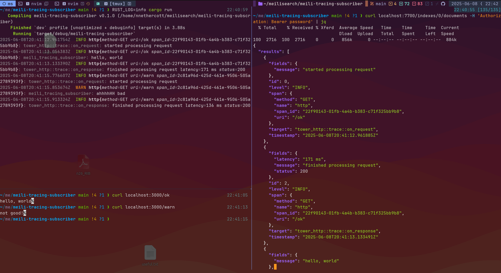

# meili-tracing-subscriber
[tracing](https://github.com/tokio-rs/tracing) + [meilisearch](https://github.com/meilisearch/meilisearch) ❤️

An example showing how to bootstrap tracing's json formatter to persist logs in meilisearch.

